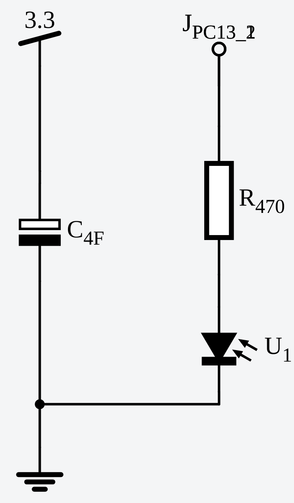
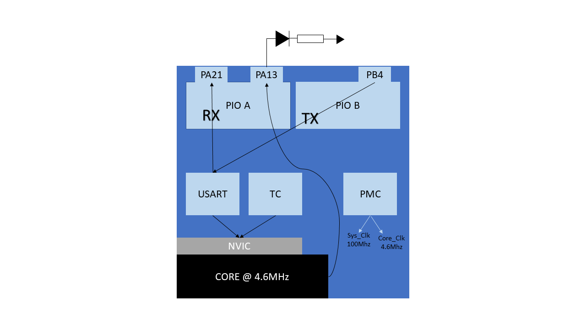

# Documentação

## Esquema

## Diagrama de Blocos

## Descrição
O funcionamento do circuito é bastante simples. Utilizando um capacitor, é necessário que um LED pisque pelo maior tempo possível. Para realizar o piscar do LED, o TC é utilizado, gerando interrupção a cada 0.5 segundo. Ao mesmo tempo, uma USART está conectada ao sistema para receber um comando que começa ou para o piscar.

Inicialmente, após desconectado da energia externa, utilizando somente o capacitor, o circuito durava cerca de 3 segundos. Para aumentar este tempo e tornar o sistema mais eficiente algumas melhorias foram realizadas:

- Clock: o clock do processador funciona normalmente a 300MHz, valor exagerado para a simplicidade do nosso sistema. Assim, foi alterado o arquivo conf_clock.h, comenatdno a linha 63 (SYSCLK_PRES_1) e descomentando a linha 69 (SYSCLK_PRES_64). Após a modificação, a nova divisão obtida é de 300/64 = 4.6MHz.
- Sleep Mode: dentro do loop principal foi colocada a ferramenta de sleep, que desabilita alguns componentes da placa. Assim, somente quando uma interrupção (do TC ou USART) acontecesse, o sistema religaria, dando continuidade ao piscar do LED. O modo de sleep utilizado foi o mais simples (que economiza menos energia).
- TC: algumas modificações foram realizadas no Timer/Counter. Primeiramente seu modo de funcionamento foi alterado para o modo Wave, possibilitando causar interrupções sem zerar o contador. Com isso, foi possível configurar dois momentos para interrupção: RA e RC. O RA causa uma interrupção a cada 1525 ciclos de clock e o RC a cada 1541 ciclos de clock (valores obtidos empiricamente baseado em uma divisão extra do clock do sistema). Assim, o piscar seria bem mais rápido, ainda respeitando o delay máximo de 0.5 segundo.
- Hardware: finalmente, o LED, inicialmente azul, foi trocado por um LED vermelho. O novo LED consome menos energia, aumentando a vida útil do sistema.

Após realizadas as modificações acima, foi possível observar uma diferença alta entre o tempo de funcionamento inicial e atual, agora em 25 minutos. A diferença é de 500 vezes.

## Possíveis Melhorias
Mesmo com a eficiência obtida com as modificações acima, ainda existem melhorias a serem implementadas, aumentando ainda mais o tempo de funcionamento. Como exemplo, em vez do TC, um RTT (Real Time Timer) poderia ser utilizado para causar interrupções. Utilizando o RTT, é possível utilizar níveis mais profundos de sleep mode (que desligam mais componentes), já que este níveis só são "acordados" por alguns poucos periféricos. Juntamente, enquanto o sistema está parado (comando na USART), o LED pode ser desligado e o TC parado, economizando ainda mais energia. Por último, a resistência utilizada com o LED poderia ter sido recalculada, adequando-se melhor ao sistema.
